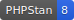
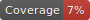

<!--

This file was written by 'make-markdown.php' line 14 using
SchenkeIo\PackagingTools\Markdown\MarkdownAssembler

Do not edit manually as it will be overwritten.

-->

# Laravel Invoice

Handling of:
- Currency
- Invoice

### Currency

#### Public methods of Currency

| method         | summary                                                        |
|----------------|----------------------------------------------------------------|
| fromAny        | static constructor from any value                              |
| fromFloat      | static constructor from a float value                          |
| fromCents      | static constructor from cents                                  |
| vatFromGross   | VAT amount from the gross price, given a VAT rate.             |
| vatFromNet     | Calculate the VAT amount from the net price, given a VAT rate. |
| fromGrossToNet | convert a gross value to a net value using VAT                 |
| fromNetToGross | Convert a net value to a gross value using VAT                 |
| toFloat        | exports to float                                               |
| str            | exports to formatted currency string                           |
| plus           | adds two objects                                               |
| minus          | subtracts two objects                                          |
| times          | multiplies the object by a factor                              |
| toLivewire     | exports to Livewire format                                     |
| fromLivewire   | static constructor from Livewire format                        |
| isEmpty        | Check if the object is empty (zero)                            |

### Invoice

#### Public methods of Invoice

| method  | summary                                          |
|---------|--------------------------------------------------|
| addLine | cent based calculation to avoid numeric glitches |
| vats    | formats the VAT values in a readable format      |
| payMe   | show pay me information                          |
| isEmpty | the total is zero                                |
| display | data for blade templates                         |

