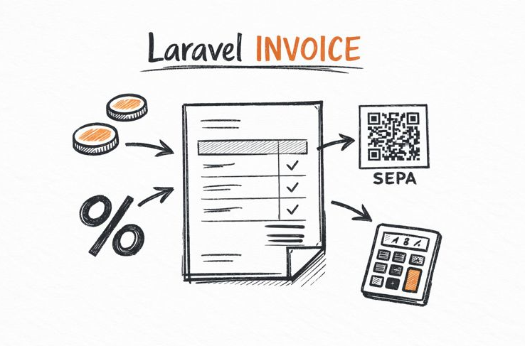

[](workbench/resources/md/svg/coverage.svg)
[](workbench/resources/md/svg/phpstan.svg)
[](https://packagist.org/packages/schenke-io/laravel-invoice)
[](https://packagist.org/packages/schenke-io/laravel-invoice)
[](https://github.com/schenke-io/laravel-invoice/actions/workflows/run-tests.yml)
[](https://github.com/schenke-io/laravel-invoice/blob/main/LICENSE.md)
[](https://packagist.org/packages/schenke-io/laravel-invoice)

<!--
********************************************************************************
*                                                                              *
*     DO NOT EDIT THIS FILE MANUALLY! IT WILL BE OVERWRITTEN.                  *
*                                                                              *
*     This file was generated by: workbench/Console/MarkdownGenerator.php
*     Source files are located in: workbench/resources/md
*
*     If you want to change the content, edit the source files instead.        *
*                                                                              *
********************************************************************************
-->
# Laravel Invoice

> A robust and flexible PHP package for Laravel that simplifies invoice management, currency handling, and complex VAT calculations.



### Key Benefits

- **Precise Financial Calculations**: Uses cent-based integer arithmetic via the `Currency` value object, eliminating common floating-point precision errors in financial data.
- **Automated VAT Logic**: Built-in support for VAT rules across multiple countries (including DE, AT, FR, CH, and more) with a hierarchical system of `InvoiceLineType`, `VatCategory`, and `VatRate`.
- **Flexible Rendering**: Generate clean HTML invoice tables out of the box, with full support for custom Blade templates when you need a personalized look.
- **SEPA Integration**: Easily generate SEPA-compliant QR codes (BezahlCode) to facilitate faster and more accurate payments.
- **Developer Friendly**: 100% test coverage, strict typing, and comprehensive documentation ensure a reliable and maintainable integration into your Laravel projects.
- **Eloquent Integration**: Custom casts for `Currency` make it easy to work with monetary values directly in your models.

# Usage Examples

Here are some examples of how to use the `laravel-invoice` package, ranging from basic currency operations to complex multi-tax invoices.

### 1. Basic Currency Operations

The `Currency` class ensures precision by using cents internally.

```php
use SchenkeIo\Invoice\Money\Currency;

// Create from various formats
$price = Currency::fromFloat(19.99);
$price2 = Currency::fromAny('12,50 €');

// Arithmetic
$total = $price->plus($price2); // 32.49 €
$discounted = $total->times(0.9); // 10% discount

echo $discounted->str(); // "29,24 €"
```

### 2. Simple Invoice Generation

Creating a basic invoice with a single tax rate.

```php
use SchenkeIo\Invoice\Invoicing\InvoiceNumeric;
use SchenkeIo\Invoice\Invoicing\Customer;
use SchenkeIo\Invoice\Invoicing\LineData;
use SchenkeIo\Invoice\Enum\InvoiceLineType;
use Carbon\Carbon;

$customer = new Customer('Jane Doe', 'Main Street 1', '12345', 'Berlin', 'DE');
$invoice = new InvoiceNumeric('INV-2023-001', Carbon::now(), $customer);

// Add items (Gross price automatically calculates Net based on type)
$invoice->addLine(LineData::fromTotalGrossPrice(
    'Web Design Service', 
    119.00, 
    InvoiceLineType::SalesDE
));

// Get HTML table for the invoice
echo $invoice->invoiceTableView(isGrossInvoice: true)->html();
```

### 3. Complex Multi-Tax Invoice

Invoices can contain items with different tax categories. The package automatically groups them in the summary.

```php
use SchenkeIo\Invoice\Invoicing\InvoiceNumeric;
use SchenkeIo\Invoice\Invoicing\LineData;
use SchenkeIo\Invoice\Enum\InvoiceLineType;

$invoice = new InvoiceNumeric('INV-002', Carbon::now(), $customer);

// Standard VAT (19% for DE)
$invoice->addLine(LineData::fromTotalNetPrice('Laptop', 1000.00, InvoiceLineType::SalesDE));

// Reduced VAT (7% for DE)
$invoice->addLine(LineData::fromTotalGrossPrice('Technical Book', 10.70, InvoiceLineType::SaleBooksDE));

// Non-taxable deposit
$invoice->addLine(LineData::fromTotalGrossPrice('Security Deposit', 500.00, InvoiceLineType::Deposit));

// The generated HTML will include a detailed tax breakdown section
echo $invoice->invoiceTableView(false)->html();
```

### 4. Multi-Country Support

The package supports VAT rates for various countries. You can specify the country code when adding lines.

```php
use SchenkeIo\Invoice\Invoicing\LineData;
use SchenkeIo\Invoice\Enum\InvoiceLineType;

// Austrian Invoice (20% Standard VAT)
$lineAT = LineData::fromTotalNetPrice(
    'Consulting', 
    100.00, 
    InvoiceLineType::SalesDE,  // Base type
    'AT'                       // Country code
);

// French Invoice (20% Standard VAT)
$lineFR = LineData::fromTotalNetPrice(
    'Service', 
    100.00, 
    InvoiceLineType::SalesDE, 
    'FR'
);
```

### 5. SEPA QR Code Integration

Generate a SEPA-compliant QR code for easy payments.

```php
use SchenkeIo\Invoice\Banking\SepaCode;

$sepa = SepaCode::fromInvoice(
    $invoice,
    'Schenke Io',
    'DE12345678901234567890',
    'Invoice',
    'ABCDEFGH' // optional BIC
);

// Get a Data URI for an  tag
echo 'dataUri() . '" />';
```

### Currency

Value object representing a monetary currency.

#### Public methods of Currency

| method         | summary                                                        |
|----------------|----------------------------------------------------------------|
| fromAny        | static constructor from any value                              |
| fromFloat      | static constructor from a float value                          |
| fromCents      | static constructor from cents                                  |
| vatFromGross   | VAT amount from the gross price, given a VAT rate.             |
| vatFromNet     | Calculate the VAT amount from the net price, given a VAT rate. |
| fromGrossToNet | convert a gross value to a net value using VAT                 |
| fromNetToGross | Convert a net value to a gross value using VAT                 |
| toFloat        | exports to float                                               |
| str            | exports to formatted currency string                           |
| plus           | adds two objects                                               |
| minus          | subtracts two objects                                          |
| times          | multiplies the object by a factor                              |
| toLivewire     | exports to Livewire format                                     |
| fromLivewire   | static constructor from Livewire format                        |
| isEmpty        | Check if the object is empty (zero)                            |

### Vat

Represents a Value Added Tax (VAT) rate and provides factory methods for countries.

#### Public methods of Vat

| method   | summary                                                         |
|----------|-----------------------------------------------------------------|
| country  | Get a country instance by its ISO code.                         |
| fromId   | Create a VAT instance from a numeric ID (e.g. '190' for 19.0%). |
| fromRate | Create a VAT instance from a float rate (e.g. 0.19 for 19%).    |

### VatCategory

Defines the high-level tax categories

#### Public methods of VatCategory

| method          | summary                                                   |
|-----------------|-----------------------------------------------------------|
| description     | German description of the category.                       |
| vatRate         | -                                                         |
| hasVat          | Checks if this transaction case involves VAT.             |
| isReverseCharge | Checks if this transaction case is a reverse charge case. |
| cases           | -                                                         |
| from            | -                                                         |
| tryFrom         | -                                                         |

### InvoiceNumeric

Main class for managing invoice data and calculations.

#### Public methods of InvoiceNumeric

| method             | summary                                                  |
|--------------------|----------------------------------------------------------|
| getTotalGrossPrice | Get the total gross price of the invoice.                |
| getTotalNetPrice   | Get the total net price of the invoice.                  |
| addWeight          | take the weight in grams and add it to the total weight  |
| addLine            | add the lines with automatic positions                   |
| payMe              | show pay me information                                  |
| isEmpty            | the total is zero                                        |
| invoiceTableView   | Prepare data for a Blade template or raw HTML rendering. |

### Customer

Data transfer object for customer information.


### LineData

Representation of a single line item on an invoice.

#### Public methods of LineData

| method              | summary                                        |
|---------------------|------------------------------------------------|
| fromTotalGrossPrice | Create a line item from its total gross price. |
| fromTotalNetPrice   | Create a line item from its total net price.   |

### InvoiceLineType

Enum defining the various types of line items that can appear on an invoice.

#### Public methods of InvoiceLineType

| method      | summary                               |
|-------------|---------------------------------------|
| vatCategory | Returns the tax category.             |
| vatRate     | Returns the applicable VAT rate type. |
| cases       | -                                     |
| from        | -                                     |
| tryFrom     | -                                     |

### InvoiceTableView

Data transfer object for the complete invoice table view.


### LineViewBase

Base class for rendering invoice lines as HTML.

#### Public methods of LineViewBase

| method | summary                                          |
|--------|--------------------------------------------------|
| html   | Generate the HTML for a single invoice line row. |

### SepaCode

Generator for SEPA QR codes (BezahlCode).

#### Public methods of SepaCode

| method      | summary                                               |
|-------------|-------------------------------------------------------|
| fromInvoice | Create a SEPA code instance directly from an invoice. |
| dataUri     | Generate the QR code as a PNG data URI.               |

# Custom invoice 

To build a custom invoice you first generate a class which 
extends `LineViewBase` and implements `LineViewInterface`. 

This class should define the column-alignment in the `columns()` method.

Then you start a new instance of `InvoiceTableView` and fill its public data.
The `columns()` method must return keys that correspond to the public properties of your custom line view class.


---

Markdown file generated by [schenke-io/packaging-tools](https://github.com/schenke-io/packaging-tools)
